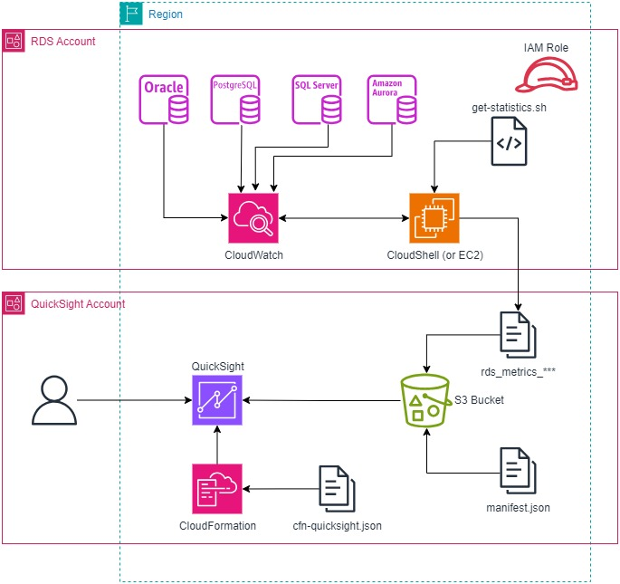
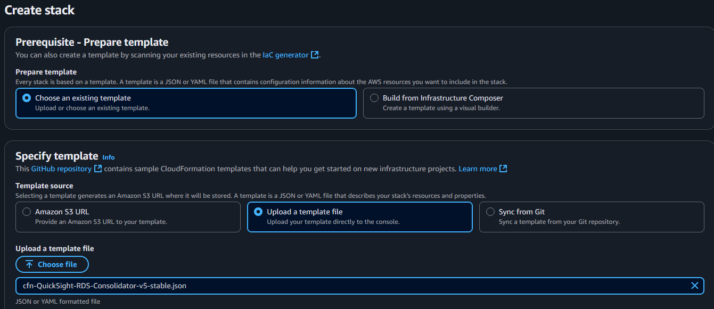
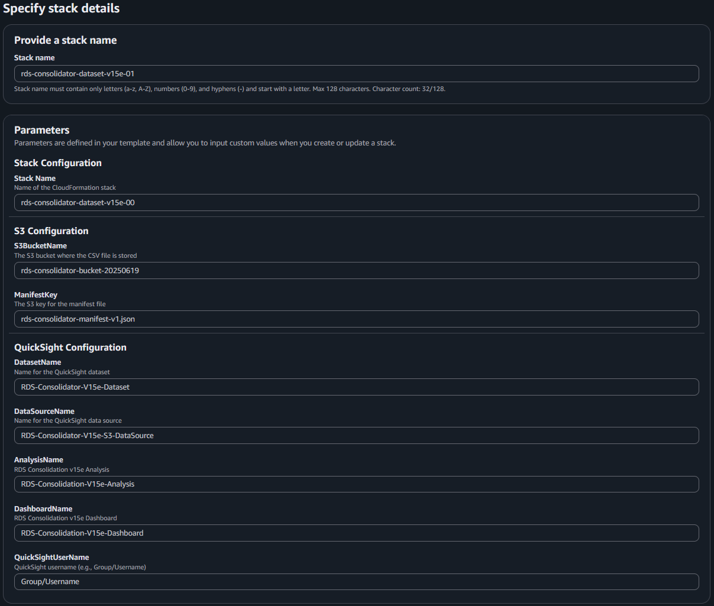
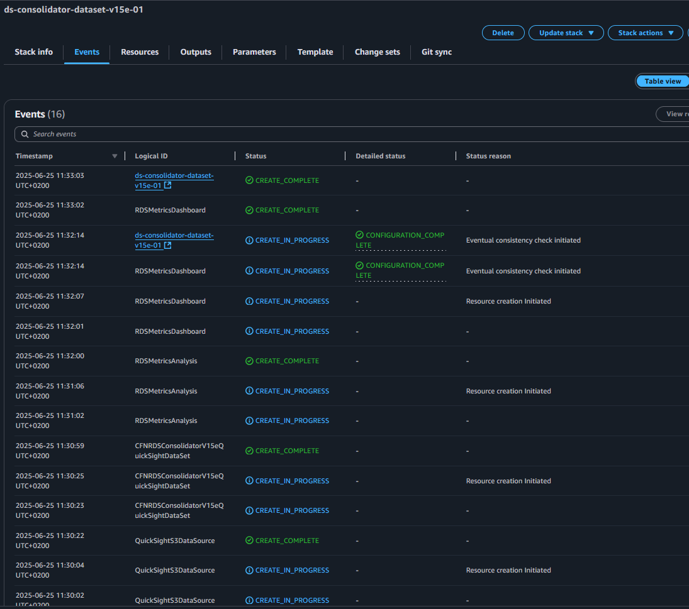
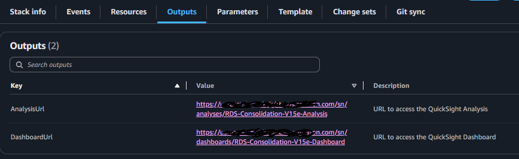

# RDS Consolidator

## Purpose

RDS Consolidator is a tool aiming to support RDS cost optimization and database consolidation initiatives.  
It is based on 2 components: A data collection script and a Quicksight dashboard.   
The script will collect RDS instances configuration & usage statistics from Amazon Cloudwatch and generate a static csv file.  
This csv file will be used as source dataset to feed a Quicksight dashboard you have to create using the Cloudformation template provided here.


## Prerequisites

- An AWS account with appropriate permissions
- A Linux machine with AWS CLI installed or use of the Cloudshell session of the account where the RDS instances are running.

## Architecture diagram


## How to use it?

### 1. Set the appropriate permissions

Create a role with the appriopriate permission and associate this role with the AWS CLI account you use. The template is included into this project and looks like:

```JSON
{  
    "Version": "2012-10-17",
    "Statement": [
        {
            "Effect": "Allow",
            "Action": [
                "rds:DescribeDBInstances",
                "cloudwatch:GetMetricStatistics",
                "cloudwatch:ListMetrics",
                "ec2:DescribeInstanceTypes"
            ],
            "Resource": "*"
        }
    ]
}
```

The file **CWGetStatisticsPolicy.json** provides the policy model.


### 2. Run the script

Once copied the latest version of the script (see versions at the bottom) in a CloudShell session of your RDS account (or in a Linux box where AWS CLI is installed), you may have to grant execution priviledges with, for instance:  
`chmod +x get-vcpu-ram-io-v16a-stable.sh`  

Then simply run the script with 2 optional parameters:  
`./get-vcpu-ram-io-v16a-stable.sh [duration] [engine]`  
where **duration** define how many days backward do you want statistics (default is 2) and **engine** is a filter on database engine for a restrictive data collection. Possible values are: ("postgres" "sqlserver-se" "sqlserver-ee" "sqlserver-web" "sqlserver-xe" "mariadb" "aurora-mysql" "aurora-postgresql" "db2-se" "oracle" "mysql"). Default (blank value) is all.

Optionally, add the `-silent` option to disable terminal output of the data collected.

### 3. Script Output

The script will generate 2 csv files. One prefix with **"rds_metrics_"** collect the hourly statistics for all the selected engines and, the other, prefixed with "rds_instances_list_" provides configuration informations of the instances analyzed.

The default display format of the TimeStamp column is **"YYYY-mm-dd HH:MM"**. This is configurable. To change this format, look for the line `DISPLAY_DATE_FORMAT="%Y-%m-%d %H:%M"` in the script and adjust the parameter value to the date format you need.

### 4. Import the csv in your Quicksight dataset for analysis

#### S3 Bucket

Create a S3 bucket in your AWS account. Upload in this bucket the **"rds_metrics_"** file generated in step 2.

#### Update the manifest file

The manifest file need to point to the csv location. In **rds-consolidator-manifest-v1.json**, replace the URI value provided as example by the URI of the csv file uploaded in your S3 bucket. To get this value, from the S3 console, get the object overview of the csv file and look for the **"S3 URI"** value.

**rds-consolidator-manifest-v1.json** should look like the example below:


`"URIs": [
        "s3://rds-consolidator-bucket-20250619/rds_metrics_20250617_143334.csv"
      ]`

Once updated, upload the manifest file to your S3 bucket next to your csv file.

#### Grant QuickSight access to the S3 bucket

From the QuickSight console, click **Manage QuickSight**, then **Security & permissions**. Under the service list, click **Manage**. In the "Allow access and autodiscovery for these resources" section, click **Select S3 buckets** and check the box for the bucket where you uploaded the output csv file.

#### CloudFormation template deployment

From the AWS CloudFormation console, initiate a new deployment stack and, upload a new template file.


Provide the requested paramaters:
- Stack name: value of your choice. the recommendation is to use the stack name template provided in the Stack Configuration parameters below.
- Parameters
  - Stack Configuration/Stack name: Template for the stack name
  - S3 Configuration/S3BucketName: Bucket name where you uploaded the csv file
  - S3 Configuration/ManifestKey: Name of the manifest file. Default value should be OK
  - QuickSight Configuration/DatasetName: Name of the QuiSight Dataset. Default value should be OK
  - QuickSight Configuration/DataSourceName: Name of the QuiSight Datasource. Default value should be OK
  - QuickSight Configuration/AnalysisName: Name of the QuiSight Analysis. Default value should be OK
  - QuickSight Configuration/DashboardName: Name of the QuiSight Dashboard. Default value should be OK
  - QuickSight Configuration/QuickSightUserName: Provide the QuickSight account where the stack will be deployed.


Submit the deployement which should last less than 5 minutes.


Once successfully completed, the stack output tab provide a direct link to the Dashboard and Analysis.



## What are the data collected by the bash script?

From Cloudwatch, the script collects hourly statistics about the VCPU/ACU, the RAM, the IOPS and the storage usage. Whenever possible, it collects the average  as well as the peak usage. It also collect configuration information like instance name, engine type and version, shape, Multi-AZ, Read-Replica...

The header of the metrics csv is:
Timestamp,Instance Name,RDS Class,Engine,Version,Multi-AZ Status,Multi-AZ Type,Read Replica,RR Primary,Aurora Role,vCPUs,ACUs,Memory(GiB),Storage(GB),Free Storage(GB),Used Storage(GB),CPU Avg%,CPU Max%,Avg vCPU Used,Peak vCPU Used,Memory Free(GiB),Memory Used%,Read IOPS Avg,Read IOPS Max,Write IOPS Avg,Write IOPS Max,Tags

## Versions

Last update: 2025, August the 13th

- Data collector
  - V7: Collect ACUs avg and max for db.serverless instance class.
  - V8: Filter report per supported DB Engine
  - V9: Added help function
  - V10: Added AWS CLI + Priviledges checking
  - V11: Added RDS instances listing with name and engine in a dedicated CSV file
  - V12: Added average vCPU used and peak vCPU used columns
  - V13b: Print 0 for missing values in vCPUs, Memory(GiB), Storage(GB), Memory Free(GiB), Memory Used%
      Added ACUs column for db.serverless instances
  - V13c: Filter out lines where no Timestamp is reported, csv fixes
  - V14a: Added Multi-AZ status to the main report
  - V14b: Added RR Primary column showing primary instance name for read replicas
  - V14c: Added Read Replica column showing Yes/No if instance is a read replica
  - V14d: Added Aurora Role column showing instance role for Aurora MySQL/PostgreSQL + Priviledges checking
  - V14e: Change output order, Timestamp moved to the first line
  - V15a: Added DatabaseConnections metric to track max number of connections to RDS instances + List of SQL Server engine edition fixed
  - V15b: Adding a Display date variable (DISPLAY_DATE_FORMAT) for the Timestamp column. Default value is "%d/%m/%Y %H:%M"
  - V15c: Added account-name, storage-type and service-type columns to the report.
  - V15d: Replace Account-name with AccountID. Change default Timestamp output. Update Service type.
  - V15e: Fix column order header
  - V16a: Extend Multi-AZ to DB and Cluster, added -silent flag for limited terminal output, Merge Read Replica for RDS and Aurora, Collect instance tags, updated help

- QuickSight CloudFormation template
  - V3: Initial template to deploy the dataset, the analysis and the dashboard. Build for CloudWatch collector V15e
  - V4: Change datasource location, dataset name, update parameters and output lists.
  - V5: Update multiples visuals, Added ACUs usage and max connections charts. 
  - V6: Update dataset and overview table with lastest csv format.

- Datasource manifest
  - V1: initial release  

## Contact

For any question, contact Yann Allandit - allandit@amazon.ch

## Security

See [CONTRIBUTING](CONTRIBUTING.md#security-issue-notifications) for more information.

## License

This project is licensed under the Apache-2.0 License.

